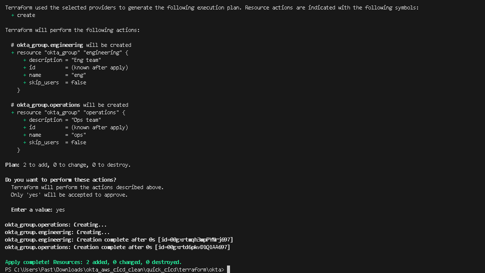

# Extremely minimal example of ci/cd pipeline.

This repo contains an example of managing AWS EC2 instances and Okta (groups) through a github/terraform workflow. Real Okta account + API Key was created for test purposes/validation.

## Okta
Okta-related Terraform lives under `terraform/okta/`. The initial configuration provisioned two basic groups (`engineering` and `operations`), a third was added later to validate. Local runs use a `terraform.tfvars` file (gitignored) for values, while the CI pipelines pull the same values from GitHub Action secrets.

We can see the first successful terraform plan on github action execution 4 below
[text](https://github.com/hydropero/quick_cicd/actions/runs/19661013658/job/56307227409#logs)

## AWS

A minimal EC2 example also exists under `terraform/aws/`. It creates a single `t3.micro` instance and exist only to show the same workflow applied to cloud infrastructure. It isn’t directly connected to the Okta portion.

## CI/CD

GitHub Actions runs Terraform automatically on any pull request or on pushes to `main` that modify files under the Terraform directories. Each workflow checks out the repo, installs Terraform, runs `terraform init` and `terraform plan` for the appropriate directory, and uses GitHub Secrets for any sensitive values such as the Okta token. 

Note - There is no apply step. The workflows validate changes and ensure plans are consistent before they’re merged.

## Future State / Prod version
If assigned to genuinely create something like this from scratch to production ready here is what I would prioritize:
- Remotely manage Terraform state (s3 likely)
- different environments dev, qa, prod, etc..
- approval stages for PR
- expand out Okta roles/identity mangagement
- federate access to AWS through Okta
- Logging and moitoring systems in place for changes being made (alerts based on certain actions)
